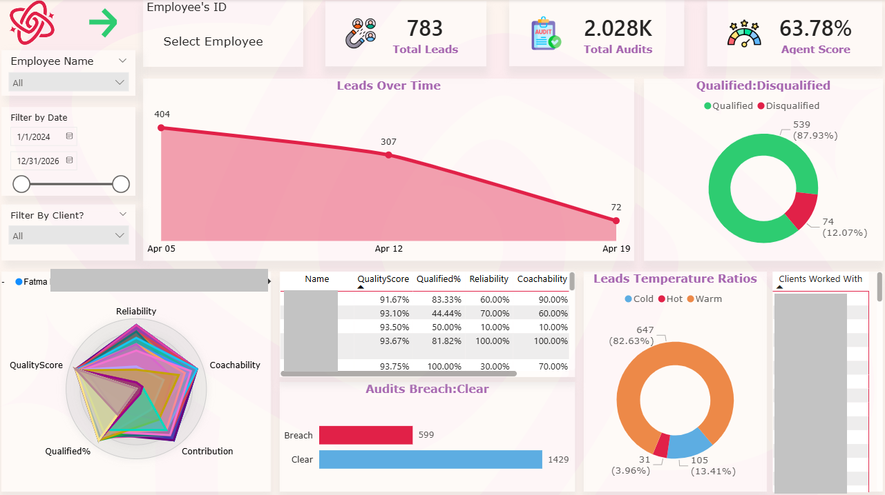
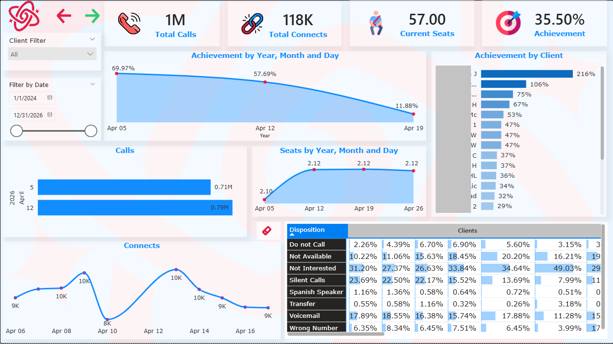
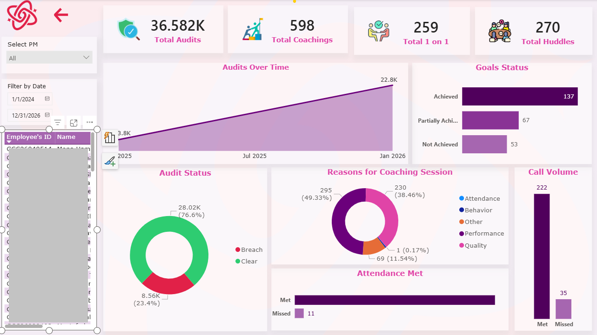
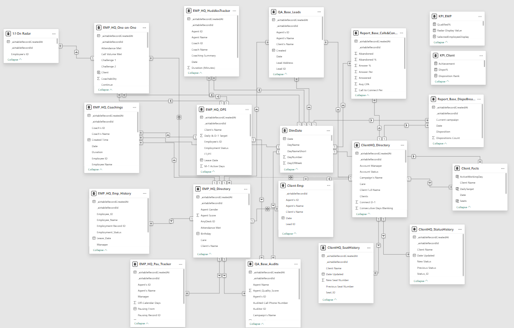

# GCC MegaDashboard Project

> Reusable Power Query (M) function to pull data from any Airtable base, table, or view into Power BI via the Airtable REST API — no connector, no third-party tool, just a single parameterized function and a Personal Access Token.

**Author:** [Your Name]

---

## 📁 Repository Structure

```
GCC-MegaDashboardProject/
│
├── AirtableConnector.pq       ← The reusable M function
├── README.md
└── images/
    ├── Dashboard_Emp.png
    ├── Dashboard_Clients.png
    ├── Dashboard_PMs.png
    └── Model.png
```

---

## ⚙️ The M Code — Airtable API Connector

### File: `AirtableConnector.pq`

```m
= (BASE_ID as text, TABLE_ID as text, VIEW_ID as text) =>
let 
    // Pagination Logic
    Pagination = List.Skip(
        List.Generate(
            () => [Page_Key = "init", Counter=0], 
            each [Page_Key] <> null, 
            each [
                Page_Key = try if [Counter] < 1 then "" else [WebCall][Value][offset] otherwise null, 
                WebCall = try if [Counter] < 1 then
                    // Initial API call without offset
                    Json.Document(
                        Web.Contents(
                            "https://api.airtable.com",
                            [
                                RelativePath = "v0/" & BASE_ID & "/" & TABLE_ID,
                                Query = [view = VIEW_ID],
                                Headers = [Authorization = "Bearer " & PERSONAL_ACCESS_TOKEN]
                            ]
                        )
                    )
                else
                    // Subsequent API calls with offset
                    Json.Document(
                        Web.Contents(
                            "https://api.airtable.com",
                            [
                                RelativePath = "v0/" & BASE_ID & "/" & TABLE_ID,
                                Query = [view = VIEW_ID, offset = [WebCall][Value][offset]],
                                Headers = [Authorization = "Bearer " & PERSONAL_ACCESS_TOKEN]
                            ]
                        )
                    ),
                Counter = [Counter] + 1 
            ],
            each [WebCall]
        ),
        1
    ),
    // Convert and Expand
    #"Converted to Table" = Table.FromList(Pagination, Splitter.SplitByNothing(), null, null, ExtraValues.Error),
    #"Expanded Column1" = Table.ExpandRecordColumn(#"Converted to Table", "Column1", {"Value"}, {"Column1.Value"}),
    #"Expanded Column1.Value" = Table.ExpandRecordColumn(#"Expanded Column1", "Column1.Value", {"records"}, {"Column1.Value.records"}),
    #"Expanded Column1.Value.records" = Table.ExpandListColumn(#"Expanded Column1.Value", "Column1.Value.records"),
    #"Expanded Column1.Value.records1" = Table.ExpandRecordColumn(
        #"Expanded Column1.Value.records", "Column1.Value.records",
        {"id", "fields", "createdTime"},
        {"_airtableRecordId", "_airtableRecordFields", "_airtableRecordCreatedAt"}
    ),
    // Reorder columns
    #"Reordered Columns" = Table.ReorderColumns(
        #"Expanded Column1.Value.records1",
        {"_airtableRecordId", "_airtableRecordCreatedAt", "_airtableRecordFields"}
    ),
    // Buffer the table to prevent multiple API calls while determining column names
    BufferedTable = Table.Buffer(#"Reordered Columns"),
    
    // Get distinct field names without converting the whole table to records
    FieldNames = List.Distinct(
        List.Combine(
            List.Transform(
                Table.Column(BufferedTable, "_airtableRecordFields"), 
                each if _ <> null then Record.FieldNames(_) else {}
            )
        )
    ),
    // Expand using the efficiently generated list
    #"Expanded Record Fields" = Table.ExpandRecordColumn(
        BufferedTable, "_airtableRecordFields", 
        FieldNames, 
        FieldNames
    )
in
    #"Expanded Record Fields"
```

---

### 🧠 How It Works

This is a **parameterized M function** — instead of writing a separate Power Query for each Airtable table, you write it once and call it with three arguments for any table you need.

#### Parameters

| Parameter | Description |
|---|---|
| `BASE_ID` | The ID of the Airtable base (starts with `app...`) |
| `TABLE_ID` | The ID of the specific table within that base (starts with `tbl...`) |
| `VIEW_ID` | The ID of the view you want to pull from (starts with `viw...`) |

> You can find these IDs in the Airtable URL when you open a table: `https://airtable.com/{BASE_ID}/{TABLE_ID}/{VIEW_ID}`

#### The `PERSONAL_ACCESS_TOKEN` Parameter

In Power BI, create a separate **query of type "Text"** named exactly `PERSONAL_ACCESS_TOKEN` and paste your Airtable PAT as its value. The function references it by name — this keeps your token in one place and out of every individual query.

#### Pagination

Airtable's API returns a maximum of **100 records per response**. For larger tables, it includes an `offset` value in the response that you must pass into the next request to fetch the next page.

The function handles this automatically using `List.Generate` — it keeps firing API requests, each time passing the previous response's `offset`, until no more `offset` is returned (meaning all records have been fetched). `List.Skip(..., 1)` drops the dummy initializer record used to bootstrap the loop.

#### Parsing & Expanding

Once all pages are collected, the function:
1. Converts the list of raw API responses into a table.
2. Drills into the nested JSON structure to reach the `records` array.
3. Expands each record into three base columns: `_airtableRecordId`, `_airtableRecordCreatedAt`, and `_airtableRecordFields`.
4. **Buffers** the table at this point — this is critical. Without buffering, Power Query re-evaluates the entire expression (including re-calling the API) each time it needs to inspect a column, which causes duplicate API calls and slower loads.
5. Dynamically collects all unique field names from the `fields` record and expands them into their own columns — so you get one column per Airtable field automatically, no matter how many fields the table has.

#### Usage Example

Once the function is created in Power Query, invoke it like this for each table you need:

```m
= AirtableConnector("appXXXXXXXXXXXXXX", "tblXXXXXXXXXXXXXX", "viwXXXXXXXXXXXXXX")
```

---

## 📊 Dashboards

### 1. Employees Dashboard



This dashboard is designed to evaluate a **single employee's performance** over any selected time period. It covers lead quality, QA scores, total leads generated, attendance, and performance breakdown across all clients the agent has worked with. It can also be flipped into a **client-centric view** — filtering by a specific client to rank and compare which agents are performing best across all tracked metrics.

---

### 2. Clients Dashboard



The Clients dashboard gives a **longitudinal view of client performance** — tracking achievement over time to identify when performance dropped or recovered, providing a basis for investigating the underlying reasons. It also surfaces call-to-connect ratios to flag volume inconsistencies, and breaks down disposition outcomes across connects, enabling a qualitative assessment of call quality for one or more clients simultaneously.

---

### 3. Performance Managers Dashboard



This is an **activity and accountability dashboard for Performance Managers**. It tracks the volume of audits, coachings, one-on-ones, and huddles conducted by each PM over a given period, and provides a breakdown of session outcomes — including which agents did not meet session goals. From there, those agents can be cross-referenced directly in the Employees dashboard to dig into their underlying numbers.

---

## 🗂️ Data Model



The data model is built across **multiple Airtable bases** and consolidates all operational data into a unified Power BI semantic model. It includes tables covering employee directory and history, QA audits, coaching and huddle sessions, one-on-ones, lead tracking, call and connect reporting, client directory and seat history, pause tracking, and a `DimDate` table for time intelligence. Relationships are defined between employee, client, and activity tables — allowing all three dashboards to share a single consistent model with cross-filtering across dimensions.

---

## 🔒 Security Note

Never hard-code your Personal Access Token directly in a query. Always store it in a dedicated `PERSONAL_ACCESS_TOKEN` parameter within Power BI and ensure the `.pbix` file is shared only with authorized users.

---

## 📄 License

This code is open source and freely reusable. If you use it, a mention or a star on the repo is always appreciated. ⭐
